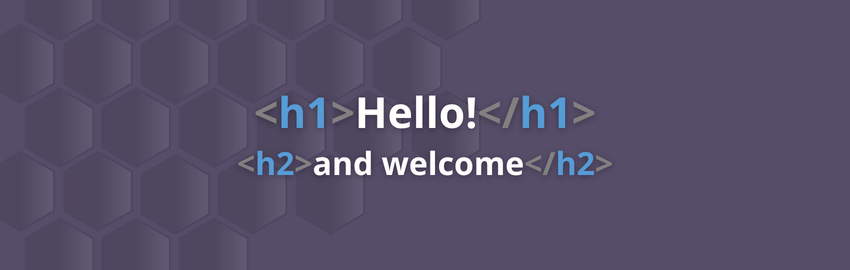

  

  I'm Nikolai Hoej Jensen, also known as "Hoej."
  I'm a Web Developer and Multimediadesigner specializing in Frontend development and UI/UX design. I create functional and visually appealing web applications, with experience in mockups, photo editing, redesigns, and other graphic design work. I hold a PBA in Web Development and an AP Degree in Multimedia Design. My lifelong passion for tech and design drives me as a creative and detail-oriented developer.

<h2 align="center">Tools & technologies I use</h2>

  During my education, including my previous studies, I have accumulated a wealth of knowledge and various tools that have aided me in my journey as a developer. These are the technologies I have worked with the most and primarily kept myself updated on. However, this does not preclude acquiring new knowledge about emerging technologies.

<h2 align="center">Contact me</h2>

  If you're interested in getting in touch with me, please don't hesitate to reach out.

